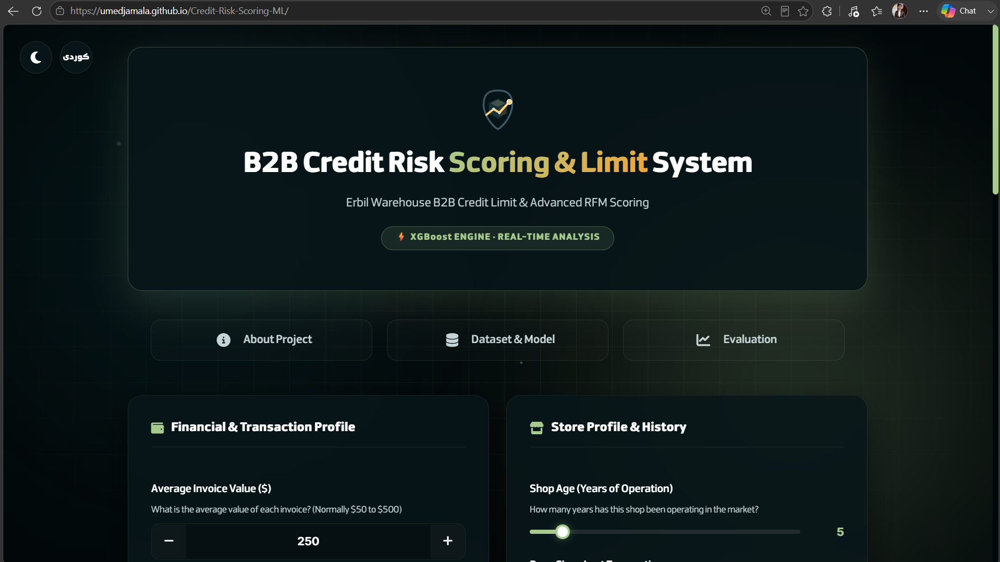
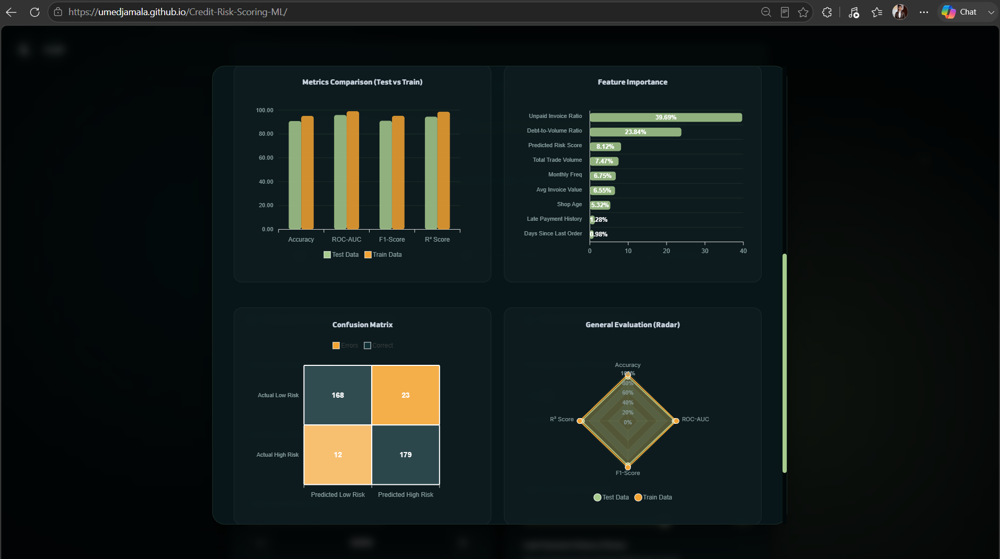
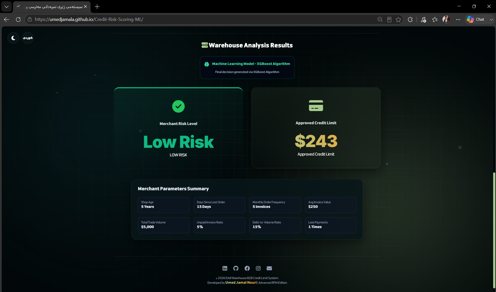
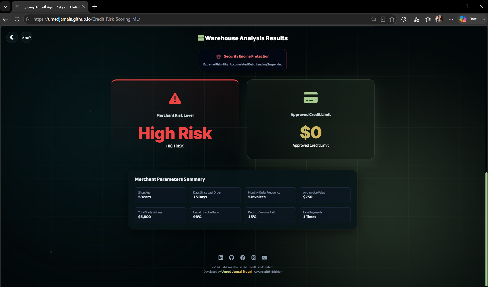

# 📦 Intelligent Credit Risk & Limit Scoring System (B2B)

> An end-to-end Machine Learning solution designed to automate and optimize credit limit approvals for B2B warehouses.


---

## 🖼️ Preview

| Dashboard (Dark Mode) | Evaluation & Charts |
|---|---|
|  |  |

| Result — Low Risk ✅ | Result — Security Block 🔴 |
|---|---|
|  |  |

---

## 🌐 Live Demo

- **Frontend Web App:** [Live Dashboard](https://umedjamala.github.io/Credit-Risk-Scoring-ML/)
- **Backend API Docs (Swagger UI):** [FastAPI on Hugging Face](https://umedjamala-credit-risk-scoring-ml.hf.space/docs)

---

## 📌 Project Overview

Currently, many B2B warehouses in the Erbil market rely on subjective, manual assessments to determine credit limits for retail shops. This often leads to accumulated debt, delayed payments, and capital loss.

This project solves that problem by introducing a highly robust, data-backed approach using an **XGBoost Algorithm** based on **Advanced RFM (Recency, Frequency, Monetary)** metrics. The system not only predicts the risk class but also calculates a precise, safe credit limit in USD for each customer.

---

## ⚙️ System Architecture

### 1. Hybrid Decision Engine (Rule-Based + AI)

To ensure maximum financial safety, the system implements "Guardrails" before the AI makes a prediction:

- **Rule Engine (Security Block):** Filters out extreme outliers (e.g., customers with >60% unpaid invoices or severe late payment histories) by setting their credit limit to $0.
- **Rule Engine (Cold Start):** Identifies new shops (under 1 year of age) and assigns a strict, minimal credit limit for testing, bypassing the AI model entirely.
- **XGBoost Engine:** For all other customers who pass the guardrails, data is passed to the fully trained ML models for a deep analysis based on their transaction history.

### 2. Machine Learning Pipeline

- **Data Preprocessing:** Utilizing the **SMOTE** technique to balance the dataset, transforming a skewed dataset of 1,200 raw records into a balanced set of **1,500+ records**.
- **Dual-Model Strategy:**
  - `Classifier:` Predicts whether a customer is **"High Risk"** or **"Low Risk"**. (Accuracy: 90.84%)
  - `Regressor:` Predicts the exact safe **Credit Limit** in USD. (R² Score: 94.52%)
- **Hyperparameter Tuning:** Both models were optimized using `RandomizedSearchCV`.

### 3. Triple Deployment (Full-Stack)

| Layer | Technology | Platform |
|---|---|---|
| **Backend API** | FastAPI (RESTful) | Hugging Face Spaces |
| **Frontend Dashboard** | HTML/JS + TailwindCSS + ApexCharts (Glassmorphism) | GitHub Pages |
| **Interactive App** | Streamlit | Hugging Face Spaces |

---

## 📊 Model Evaluation Metrics (Test Data)

| Metric | Risk Classifier | Credit Limit Regressor |
|---|---|---|
| **Primary Score** | Accuracy: 90.84% | R² Score: 94.52% |
| **Secondary Score** | ROC-AUC: 95.92% | RMSE: $96.21 |
| **Tertiary Score** | F1-Score: 91.09% | MAE: $41.33 |

---

## 🚀 How to Run Locally

### 1. Requirements

```bash
Python 3.9+
pip install -r requirements.txt
```

### 2. Start the Backend Server

```bash
uvicorn main:app --reload --port 8000
```

### 3. Run the Frontend Dashboard

Open `index.html` in any modern browser, or use a Live Server extension in VS Code.
> ⚠️ Make sure to update the API URL in `index.html` to `http://127.0.0.1:8000/predict` when testing locally.

### 4. Run the Streamlit App

```bash
streamlit run streamlit_app.py
```

---

## 👨‍💻 Developer

**Umed Jamal Nouri**
*Electrical Engineering Student (Senior)*
*AI & Machine Learning Developer*

🔗 [LinkedIn Profile](https://linkedin.com/in/UmedJaMala) | 🔗 [GitHub Profile](https://github.com/UmedJaMala)
